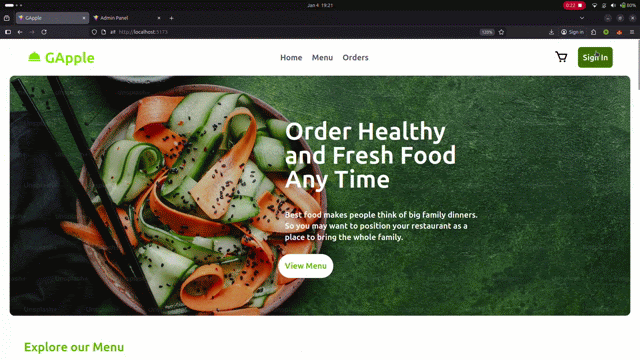
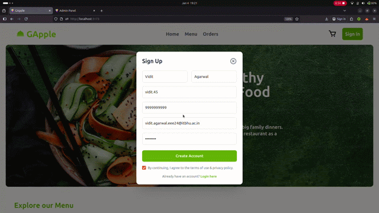
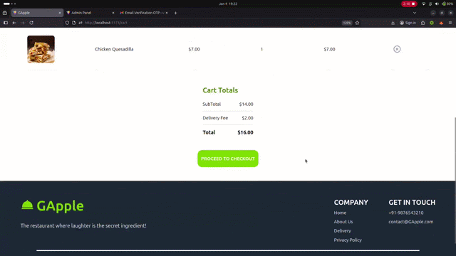
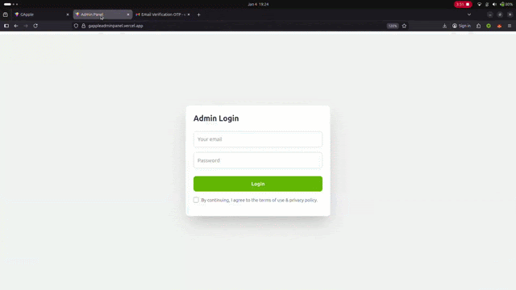
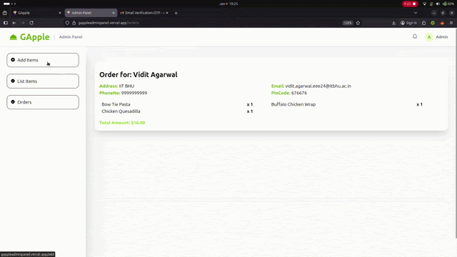
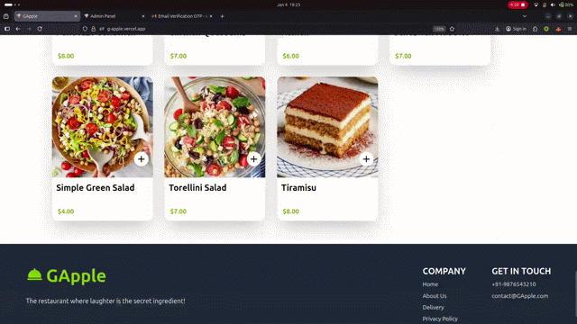

# GApple 🍏

Welcome to **GApple**, your ultimate destination to **order the most delicious food** right from your browser. From spicy starters to mouth-watering desserts, we bring the best restaurant experience to your doorstep.


## 🛠️ Tech Stack
- **Frontend:** React, Vite, Tailwind CSS, Context API
- **Backend:** Django REST Framework, Python
- **Database:** SQLite (Development)
- **Authentication:** Custom PyOTP (Time-based Email OTP)
- **Payments:** Stripe Integration

---

## 📸 Complete Application Guide

<table>
  <tr>
    <td width="50%">
      
    </td>
    <td width="50%">
      <h3>1. User Registration</h3>
      <p>The journey begins with a seamless user registration process. The user fills in their basic details—such as name, email, and password—and clicks on sign up to create a new account.</p>
    </td>
  </tr>
</table>

<table>
  <tr>
    <td width="50%">
      <h3>2. Two-Step Email Authentication (OTP)</h3>
      <p>Security is a top priority. As soon as a user signs up, the system requires 2-step email verification. A unique OTP is sent to their registered email address. The user opens their inbox, retrieves the OTP, and enters it on the verification screen to successfully activate their account.</p>
    </td>
    <td width="50%">
      
    </td>
  </tr>
</table>

<table>
  <tr>
    <td width="50%">
      
    </td>
    <td width="50%">
      <h3>3. Interactive Menu & Cart Management</h3>
      <p>Users can browse the dynamic menu and seamlessly add items to their cart. By clicking the plus and minus icons, they can adjust quantities on the fly. Clicking the cart button reveals a complete, categorized list of selected items along with the calculated total order amount.</p>
    </td>
  </tr>
</table>

<table>
  <tr>
    <td width="50%">
      <h3>4. Delivery Information</h3>
      <p>Once the user is satisfied with their cart, they proceed to provide their delivery information. The intuitive form captures essential details like name, pincode, delivery address, and mobile number to ensure accurate order fulfillment.</p>
    </td>
    <td width="50%">
      
    </td>
  </tr>
</table>

<table>
  <tr>
    <td width="50%">
      
    </td>
    <td width="50%">
      <h3>5. Stripe Payment Gateway Checkout</h3>
      <p>As soon as the user clicks on "Proceed to Checkout", the secure Stripe payment gateway opens. The user inputs their card details (using standard Stripe dummy credentials for testing) and completes the payment, successfully placing their food order.</p>
    </td>
  </tr>
</table>

<table>
  <tr>
    <td width="50%">
      <h3>6. Admin Dashboard & Order Tracking</h3>
      <p>The application features a completely separate administrative portal. The admin logs in using their secure superuser credentials and is immediately greeted by the order list page, providing a bird's-eye view of all incoming orders.</p>
    </td>
    <td width="50%">
      
    </td>
  </tr>
</table>

<table>
  <tr>
    <td width="50%">
      
    </td>
    <td width="50%">
      <h3>7. Adding New Menu Items (Admin)</h3>
      <p>The admin has full control over the restaurant's offerings. Here, the admin demonstrates adding a new "Tiramisu" dessert to the catalog. They fill out the product details, select a category, upload an image, and submit it to instantly update the database.</p>
    </td>
  </tr>
</table>

<table>
  <tr>
    <td width="50%">
      <h3>8. Real-time Catalog Updates</h3>
      <p>Menu management works both ways. In this final step, the admin removes the newly created "Tiramisu" from the catalog. Switching back to the user portal and refreshing the page proves that the Tiramisu has instantly disappeared from the public menu.</p>
    </td>
    <td width="50%">
      
    </td>
  </tr>
</table>

---

## 💻 Local Setup Instructions

### 1) Prerequisites
Make sure you have Node.js and Python installed on your system. [Download Node.js here](https://nodejs.org/)

### 2) Run the Frontend
```bash
cd food-app
npm install
npm run dev
```
The frontend should now open at `http://localhost:5173`. 
Create a `.env` file in the `food-app` directory and add:
```env
VITE_API_BASE_URL=http://localhost:8000/api/
```

### 3) Run the Backend
```bash
cd food-app/backend
pip install -r requirements.txt
python manage.py runserver
```
Your backend API should be running at `http://localhost:8000`.

### 4) Run the Admin Panel
```bash
cd adminPanel/food-app-admin-panel
npm install
npm run dev
```
The admin panel should now open at `http://localhost:5174`.
Create a `.env` file in the `adminPanel/food-app-admin-panel` directory and add:
```env
VITE_API_BASE_URL=http://localhost:8000/api/
```

---

## 🎬 Full Demo Video
[Watch the complete demo video here](https://drive.google.com/file/d/1Kr5FmL9IeUP-_HypgNcWbT_U43HzmxDN/view?usp=sharing)